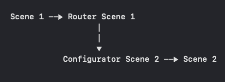

# #мамавыдохни: напоминания
#### Модуль проекта [#мамавыдохни](https://github.com/4440449/Mom_Exhale)

## Tech spec
- MVVM + R + State(два экрана синхронят данные между собой). Элементы Clean architecture
- Каждый экран выделен в отдельную сцену со своим окружением (Configurator, VM, Router)
- DI для каждой сцены со сбокрой через static объект
- Task management для возможности контроля задачи (при необходимости)
- Observing через [собственную библиотеку](https://github.com/4440449/MommysEye)
- Network через [собственную библиотеку](https://github.com/4440449/BabyNet)
- Backend - <a href="https://app.supabase.com">Supabase</a>
- Local storage - Core data
- Local push notifications api
- UI кодом, UIKit
- Dark mode
- Custom navigation transitions
 
 
## Features 
* Плоский Navigation Flow, **по схеме:**
  
Роутер 1 дергает Конфигуратор 2 и передает:
    1. **Navigation container**  
    Обычный рут навигейшн контроллер.
    При необходимости Конфиг 2 может создать свой поток со своей навигацией, при этом храня или передавая дальше ссылку на рутовый контейнер для обратного Pop.
    2. [Repository Container]( https://github.com/4440449/CalmMom/blob/master/CalmingNotifications/Data/DIContainer/GatewaysRepositoryDIContainer_CN.swift)  
    Из которого Конфиг 2 самостоятельно достает необходимый ему пул Репозиториев и создает полное окружение Сцены. Такая схема возможна благодаря Clean architecture подходу, где Бизнес сущности оформляются с собственным интерфейсом (Gateways), далее эти интерфейсы реализуют Репозитории, далее репозитории упаковываются в DI Repository Container, который просто хранит состояние и которого просто шарят между сценами.  
    
    Такой подход позволяет исключить недостатки год объектов в виде Coordinator или DI инъектора, которые знают и рулят зависимостями всех сцен.  
    
    Недостаток в том, что если на экран 'В' не нужен ни репозиторий ни навигейшн контейнер, но на следующем экране 'С' они обязательны, то экран 'В' обязать протащить через себя эти зависимости для передачи их в 'С'. 

* DTO  
Для работы в репозитории выделены отдельные сущности с необходимым для осуществления локальной логики пулом параметров.

* Error handling  
У каждой бизнес сущности [определены собственные Errors](https://github.com/4440449/CalmMom/blob/master/CalmingNotifications/Domain/Entities/QuoteCard/Error/QuoteCardError_CN.swift) исходя из бизнес логики (работаем ли мы с сетью, даем пользователю возможность хранить данные локально, используем системные api и т.п.)  
Начиная с возникновения ошибки в Репозитории далее происходит ее [маппинг в Ошибку бизнес слоя](https://github.com/4440449/CalmMom/blob/master/CalmingNotifications/Data/Gateways/QuoteCard/ErrorHandler/QuoteCardErrorHandler_CN.swift), которая далее передается в Презентейшн слой, в котором, *в зависимости от сцены* могут быть [добавлены дополнительные действия (Actions)](https://github.com/4440449/CalmMom/blob/master/CalmingNotifications/Presentation/Scenes/Splash/ViewModel/ErrorHandler/SplashErrorHandler_CN.swift), например - предложить пользователю загрузить данные снова, линк в настройки и т.п.
        
* Финальный продукт [запакован в SPM](https://github.com/4440449/CalmingNotificationsModule) и инъектися в основной проект, как обычный пакет.  
Практически вся реализация модуля остается приватной для изменений и вызовов из основного проекта. Точка входа - единственный публичный static метод, который возвращает готовый UIViewController.  

## TODO:
- Возможность работать полностью оффлайн
- Апнуть нотификации до Remote
- In app handling dark mode

# HOW TO USE APP:

# MARKETING: 

